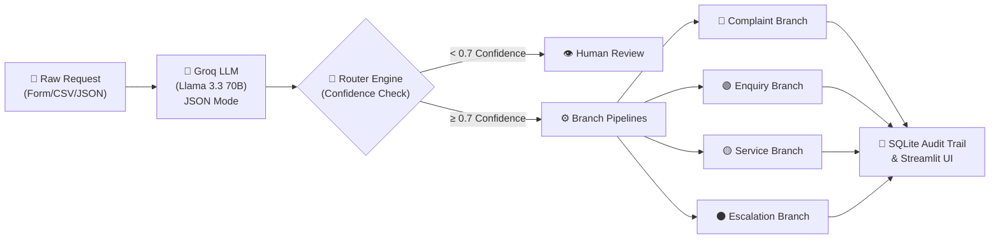

# 📊 5-Slide Executive Deck
## AI-Powered Incoming Request Processing Workflow

---

### 🟢 Slide 1: Executive Summary & Objective

#### **The Challenge**
- **Manual Overhead:** Operations teams spend hours reading, categorizing, and assigning incoming customer queries.
- **Inconsistent Execution:** Generic one-size-fits-all responses fail complex complaints or high-risk escalations.
- **SLA Breach Risks:** Critical issues get buried under routine informational enquiries.

#### **The AI Solution**
- An **intelligent end-to-end automation workflow** that ingests raw customer text, classifies request intent with **Llama 3.3 70B**, and executes tailored **multi-step remediation pipelines**.

#### **Key Outcomes**
- **4 Distinct Remediation Branches** (Complaint, Enquiry, Service Request, Escalation)
- **Zero Cost Stack:** Groq API + Streamlit + SQLite ($0 total expense)
- **Built-in Guardrails:** Confidence thresholding (<0.7 → Human Review Queue)

---

### 🟢 Slide 2: System Architecture & Technology Stack

#### **Core Tech Stack**
- **LLM Engine:** Groq API (`llama-3.3-70b-versatile`) — Fast inference & strict `json_object` format.
- **Orchestration:** Python (Custom deterministic workflow engine).
- **Frontend & Dashboard:** Streamlit (Multi-page interactive UI).
- **Persistence Layer:** SQLite (Full audit trail & case history).

---

### 🟢 Slide 3: Multi-Step Remediation Branching Logic

Every request triggers a **distinct 4-step sequence** rather than a generic template:

| Branch Type | Urgency | Key Remediation Steps | Target Outcome |
| :--- | :--- | :--- | :--- |
| 🔴 **Complaint** | **HIGH** | 1. Ack Draft → 2. Escalate to Senior → 3. Log Priority → 4. 2hr Follow-up Timer | **Relationship Protection** |
| 🟢 **General Enquiry** | **LOW** | 1. Sub-topic Tag → 2. KB AI Answer → 3. Auto-respond Tag → 4. Close Case | **Instant Auto-Resolution** |
| 🟡 **Service Request** | **MEDIUM**| 1. Entity Extract → 2. Dept Routing → 3. Ticket Confirmation → 4. SLA Timer | **Accurate Operational Routing** |
| ⚫ **Escalation** | **CRITICAL**| 1. Flag Human Review → 2. Draft Supervisor Ack → 3. Alert Manager → 4. Freeze Auto-Actions | **Risk Mitigation & Containment** |

---

### 🟢 Slide 4: AI Guardrails & Human-in-the-Loop Architecture

#### **1. Structured Classification Assurance**
- Uses **JSON Mode** and Pydantic validation to eliminate malformed outputs or hallucinated category labels.

#### **2. Confidence Gate & Thresholding**
- Requests with classification confidence **< 70%** automatically divert to the **Human Review Queue**.
- Operators review the AI's best guess, reasonings, and can **Accept** or **Override** decisions with 1 click.

#### **3. High-Risk Containment (Escalation Branch)**
- Legal threats or safety concerns pause automated execution to prevent unintended automated commitments.

---

### 🟢 Slide 5: Business Impact & Deliverables

#### **Key Metrics & Value**
- **⚡ Processing Speed:** < 2 seconds average processing time per request.
- **📉 Workload Reduction:** Up to 60-70% auto-resolution rate for routine enquiries.
- **🎯 Classification Accuracy:** > 80% benchmark on synthetic test scenarios.

#### **Project Deliverables**
- 🔗 **GitHub Repository:** [Axxhit/AI-Request-Processing-Workflow](https://github.com/Axxhit/AI-Request-Processing-Workflow)
- 🖥️ **Live Web Application:** Interactive Streamlit Dashboard (Local / Streamlit Cloud ready).
- 🧪 **Test Suite:** `pytest` test suite with 25 synthetic validation test cases.
