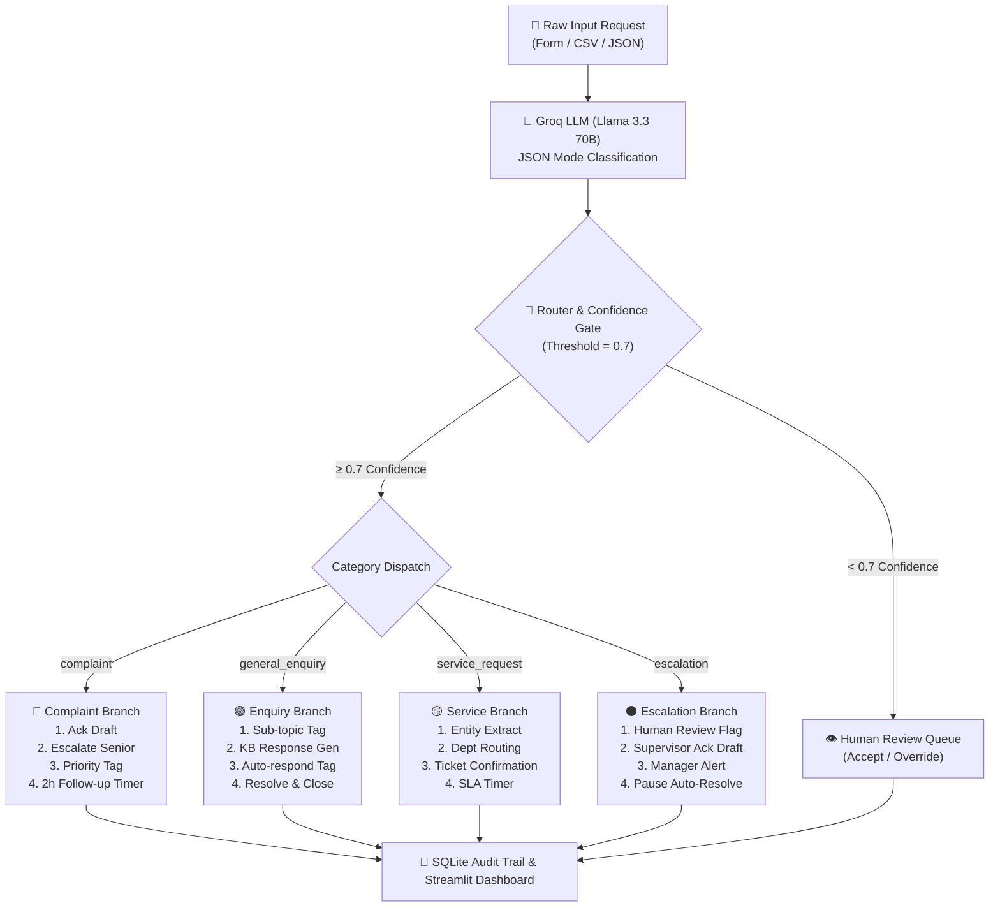

# 📊 5-Slide Executive Deck
## AI-Powered Incoming Request Processing Workflow

---

### 🟢 Slide 1: Problem Understanding and Objective

#### **Problem Statement & Background**
- **Manual Operational Bottlenecks:** Operations teams manually process high volumes of incoming customer requests (emails, forms, tickets).
- **One-Size-Fits-All Failure:** Generic single-step responses fail because a billing dispute requires a vastly different workflow than a general enquiry or critical escalation.
- **SLA & Escalation Risks:** Critical legal threats or severe complaints get delayed in general queues, risking customer churn and regulatory issues.

#### **Objective & Scope**
- Build an AI-powered prototype that automatically **receives, classifies, and processes** requests.
- Trigger **multi-step branching remediation workflows** (≥2 downstream steps per branch) across 4 distinct request categories:
  - 🔴 **Complaint** (High urgency)
  - 🟢 **General Enquiry** (Low urgency)
  - 🟡 **Service Request** (Medium urgency)
  - ⚫ **Escalation** (Critical urgency)

---

### 🟢 Slide 2: Solution Architecture and Design Flow



---

### 🟢 Slide 3: Implementation Highlights

#### **Key Technical Decisions**
- **Groq API + Llama 3.3 70B:** Fast inference with strict `response_format={"type": "json_object"}` for structured classification.
- **Code-First Deterministic Routing:** LLM used for judgment (classification/generation); Python used for reliable workflow routing.
- **Prompt Chaining:** Injects Phase 2 classification context directly into Phase 3 response generation prompts.

#### **Concise Code Snippet (Router & Dispatch)**
```python
# Deterministic Branch Dispatch Engine
BRANCH_MAP = {
    "complaint": ComplaintWorkflow,
    "general_enquiry": EnquiryWorkflow,
    "service_request": ServiceRequestWorkflow,
    "escalation": EscalationWorkflow,
}

def process_request(raw_text: str) -> CaseRecord:
    classification = classify_request(raw_text)
    if classification.confidence < 0.7:
        return route_to_human_review(classification, raw_text)
    
    workflow_cls = BRANCH_MAP[classification.request_type]
    result = workflow_cls(classification, raw_text).execute()
    return save_and_return_case(result)
```

---

### 🟢 Slide 4: Challenges and Learnings

#### **Key Challenges & Trade-offs**
1. **n8n Cloud vs Pure Python:** Evaluated n8n Cloud (14-day trial limit) vs Docker (heavy dependency). Opted for **Pure Python + Streamlit**, providing zero-dependency 1-click cloud deployment with a custom Streamlit visual step tracker.
2. **Deterministic Output Enforcement:** Managed LLM hallucination risk by enforcing Pydantic schema validation and low temperature (`0.1`) during classification.
3. **Rate Limit Handling:** Implemented exponential backoff retries (1s → 2s → 4s) in `groq_client.py` for Groq's free tier (30 RPM).

#### **Key Learnings**
- **Decoupled Architecture:** Separating classification, workflow execution, and UI layers makes testing and adding new branches effortless.
- **Guardrails Matter:** Confidence thresholding (<0.7) and pausing auto-resolution on escalations prevents automated mistakes in high-stakes scenarios.

---

### 🟢 Slide 5: Demo Summary and Next Steps

#### **Final Solution Summary**
- **Interactive Multi-Page Streamlit App:** Form intake, CSV/JSON batch processing, Plotly metrics dashboard, searchable audit trail, and human review queue.
- **Full Test Coverage:** `pytest` test suite with 25 synthetic validation test cases.

#### **Links & Repository**
- 🔗 **GitHub Repository:** [Axxhit/AI-Request-Processing-Workflow](https://github.com/Axxhit/AI-Request-Processing-Workflow)
- 🖥️ **Streamlit Cloud Ready:** Configured with `st.secrets` for 1-click deployment.

#### **Future Enhancements (With More Time)**
- **Vector DB / RAG Integration:** Connect Pinecone/Chroma to fetch actual corporate KB documents for enquiry responses.
- **Real CRM Integration:** Connect webhooks to Salesforce/Zendesk for live ticket creation.
- **Multi-modal Support:** Process voice messages or scanned PDF request documents.
